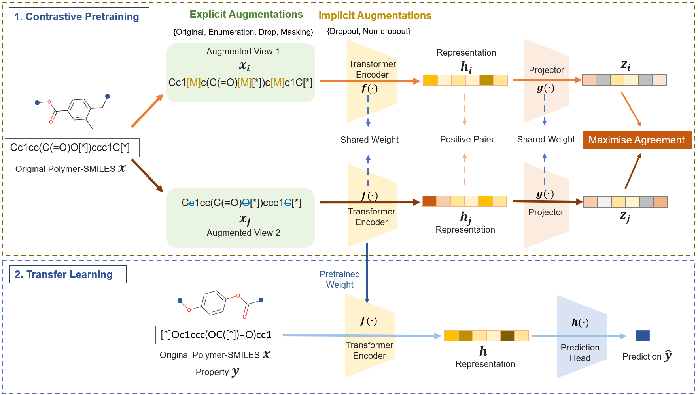

# PolyCL
This repository contains data and codes for PolyCL.

## Description


## Requirements<br />
#### Model Essentials

```
# create a new environment
$ conda create --name polycl python=3.9
$ conda activate polycl

# install requirements
#$ pip install numpy==1.26.4
#$ pip install pandas==1.3.3
#$ pip install scikit-learn==0.24.2
$ pip install torch==1.12.0+cu113 -f https://download.pytorch.org/whl/torch_stable.html
$ pip install transformers==4.20.1
$ pip install -U torchmetrics
$ pip install tensorboard
$ pip install tqdm
$ conda install -c conda-forge rdkit
```
#### Extra Packages for Benchmarking
```
pip install torch-geometric==1.7.2 torch-sparse==0.6.18 torch-scatter==2.1.2 -f https://pytorch-geometric.com/whl/torch-1.12.0+cu113.html
```

## Easy Usage of PolyCL as a Polymer Feature Extractor
- Dependency: You will need only ```polycl.py``` in this repository and ```torch```,```transformers``` packages as the minimum requirement.
- Obtain the polymer embedding: Simply follow the demonstration in ```PolyCL_Easy_Usage.ipynb```.


## Run the Model <br />
### 1. Pretraining 
Run with key parameters for the pretraining summarized in ```config.json```.
```
train.py
```
### 2. Transfer Learning 
Run with sample configurations described in ```config_tf_notebook.json```.
```
transfer_learning.py
```
## Benchmarking Other Models <br />
Models available for benchmarking are stored in the ```./benchmark/``` directory.

### Pretrained Models
- #### polyBERT <br />
  - Run ```tf_polybert.py ``` and polyBERT model will be automatically downloaded from https://huggingface.co/kuelumbus/polyBERT .
- #### Transpolymer <br />
  - Download the model folder of Transpolymer "pretrain.pt" from https://github.com/ChangwenXu98/TransPolymer/tree/master/ckpt . <br />
  - Put the folder to the directory ```"./model/Trasnpolymer/"``` to be referred to as ```"./model/Trasnpolymer/pretrain.pt"```.
  - Run ```tf_transpolymer.py```.<br /> 

### Supervised Models
- #### GNNs <br />
  - Assign "gcn" or "gin" to the key "gnn_type" in ```config_graph.json``` to use different types of GNNs.
  - Run ```gnn.py```.
- #### ECFP Methods
  - Run ```morgan_nn.py``` to use neural network.
  - Run ```rf.py``` to use random forest.
  - Run ```xgb.py``` to use XGBoost.

